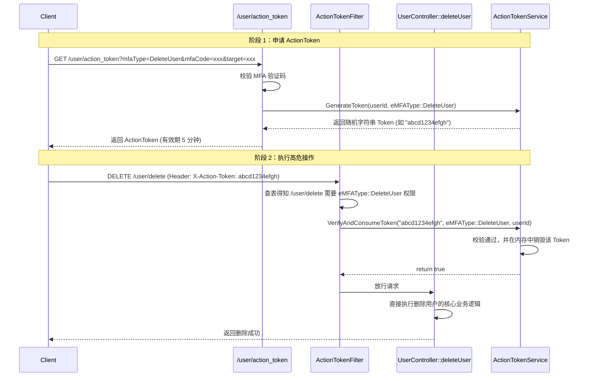

# ActionToken 架构设计与使用指南

## 1. 架构背景与目的

在传统的系统设计中，诸如“删除用户”、“解绑第三方账号”、“修改密码”等高危敏感操作，通常需要在接口内部硬编码 MFA（多因素认证）校验逻辑。这导致了以下问题：
1. **代码冗余**：多个高危接口需要重复编写接收 `mfaCode`、调用校验服务、处理校验失败的逻辑。
2. **职责耦合**：业务控制器（Controller）除了处理核心业务外，还要负责繁琐的安全鉴权。
3. **扩展性差**：当需要新增一个高危操作或修改安全校验规则时，需要修改每个对应的接口逻辑。

**ActionToken 架构**旨在解决上述问题，它引入了“基于业务类别的一次性授权令牌”机制：
- 用户在执行高危操作前，先通过统一的入口（如 `/user/action_token`）进行 MFA 校验，并获取一个不透明的随机字符串（ActionToken）。
- 该 Token 与特定的**业务类别（Action Category）**绑定，具有较短的有效期（默认 5 分钟），且**阅后即焚（一次性）**，有效防止重放攻击。
- 通过 Drogon 的拦截器（`HttpFilter`），在请求到达业务逻辑前自动拦截并校验 ActionToken，从而将安全鉴权与核心业务逻辑完全解耦。

---

## 2. 核心组件

ActionToken 架构由以下三个核心组件构成：

### 2.1 ActionTokenService (服务层)
负责 Token 的生成、存储、校验与销毁。
- **存储机制**：利用 Drogon 内置的线程安全缓存 `drogon::CacheMap`，将 Token 存储在内存中。依靠框架底层的 Event Loop 自动清理过期数据，无需引入 Redis 等外部依赖，轻量且高效。
- **Token 形式**：使用去除了连字符的 UUID 作为不透明随机字符串，不包含任何可解析的明文信息。
- **核心接口**：
  - `GenerateToken(int userId, eMFAType actionCategory, const std::string& boundTarget = "")`：生成 Token。匿名场景下会绑定 `target`。
  - `VerifyAndConsumeToken(const std::string& token, eMFAType expectedAction, int userId, const std::string& requestTarget = "")`：校验 Token（包括所属用户、业务类别、有效性，以及匿名场景下的目标一致性），一旦校验成功立即从缓存中删除（消耗）。

### 2.2 ActionTokenFilter (拦截层)
作为 Drogon 的 `HttpFilter`，充当鉴权网关。
- **路由映射**：在 Filter 内部维护了一张从“接口路径”到“业务类别 (`eMFAType`)”的映射表（`_routeToActionMap`）。例如：`/user/delete` 映射到 `eMFAType::DeleteUser`。
- **拦截逻辑**：
  1. 获取当前请求的路径（`req->path()`），查表得出该接口需要的 `expectedAction`。
  2. 从 HTTP 请求头 `X-Action-Token` 中提取客户端传递的 Token。
  3. 依赖前置的 `AuthFilter` 注入的 `userId`，调用 `ActionTokenService` 进行严格校验。
  4. 校验通过则放行（`fccb()`），否则直接拦截并返回错误响应。

### 2.3 统一 Token 颁发接口 (入口层)
后端提供了两个入口用于颁发 Token：
- **`/user/action_token` (登录后)**：需要 `AuthFilter` 验证。用于诸如 "DeleteUser", "ModifyUser", "Unbind" 等需要已知用户身份的高危操作。
- **`/user/action_token/anonymous` (登录前/匿名)**：无需登录。专门用于诸如 "Login", "Register", "ResetPassword" 等用户尚未建立登录会话的场景，该接口颁发的 Token 会固定绑定到 `userId = -1`，并绑定申请时传入的 `target`（邮箱/手机号）。

客户端通过此接口，在 Query 参数中提供当前绑定方式的 `mfaCode`、`target` 以及期望执行的 `mfaType` (如 "DeleteUser" 或 "Login")。后端验证 MFA 成功后，调用 `ActionTokenService` 颁发 Token。该接口的方法是 `GET`。

> **特殊场景处理 (无联系方式用户)**：
> 对于通过第三方登录（如 GitLab/OAuth2）直接注册且尚未绑定邮箱或手机号的用户，由于缺乏 MFA 验证渠道，`/user/action_token` 接口会跳过 MFA 校验并直接颁发 ActionToken。这允许此类用户执行敏感操作，如绑定第一个邮箱或手机号。一旦用户完成绑定，后续的所有敏感操作将恢复强制性的 MFA 校验。

---

## 3. 请求交互流程

以“删除用户”为例，完整的交互流程如下：



---

## 4. 开发者使用指南 (如何接入新接口)

如果你需要开发一个新的高危敏感接口（例如：修改密码 `/user/password/update`），只需按照以下两步操作即可接入 ActionToken 架构，**无需在业务代码中编写任何 MFA 校验逻辑**。

### 第一步：在 ActionTokenService 中配置统一映射
打开 `services/ActionTokenService.cpp`，在构造函数中为你的新接口添加路由映射，复用已有的 `eMFAType`：

```cpp
ActionTokenService::ActionTokenService() {
    // ... 其他初始化代码 ...

    // ========================================
    // 统一配置：路由 -> Action 类别 (复用 eMFAType)
    // 格式: "METHOD:PATH"
    // ========================================
    _routeToActionMap["DELETE:/user/delete"] = eMFAType::DeleteUser;
    _routeToActionMap["POST:/api/third/unbind"] = eMFAType::Unbind;
    
    // 新增：修改密码接口需要 eMFAType::ModifyUser 权限
    _routeToActionMap["POST:/user/password/update"] = eMFAType::ModifyUser;
}
```

### 第二步：在 Controller 注册路由时挂载 Filter
打开你的 Controller 头文件，在 `METHOD_LIST_BEGIN` 宏中，为该接口叠加 `ActionTokenFilter`。
> **注意**：`ActionTokenFilter` 必须在 `AuthFilter` 之后执行，因为它依赖 `AuthFilter` 注入的 `userId`。

```cpp
// 确保 "ActionTokenFilter" 紧跟在 "AuthFilter" 之后
ADD_METHOD_TO(UserController::updatePassword, "/user/password/update", Post, "AuthFilter", "ActionTokenFilter");
```

完成以上配置后，你的业务代码（`updatePassword` 的具体实现）就可以完全专注于修改密码的逻辑，彻底摆脱 `mfaCode` 和 `target` 等参数的干扰！

---

## 5. 优势总结

1. **极致解耦**：业务代码不再关心权限和验证码，代码变得异常干净。
2. **极高安全性**：内存管理、不透明随机串、严格的归属校验、**阅后即焚（单次消耗）**，从根本上杜绝了重放攻击。
3. **表现层透明**：API 路由（URL）可以随意更改重构，只要 `Action Category` 不变，底层的授权逻辑就无需修改。
4. **支持多步操作**：未来如果一个业务类别包含多个子接口（例如修改安全信息需要调用三个接口），只需颁发一个类别为 `Action_UpdateSecurity` 的 Token（若要支持多步，可修改 `VerifyAndConsumeToken` 中暂不立刻 erase 的逻辑，或允许同一类别多次访问，目前默认为单次消耗以保证最高安全）。
